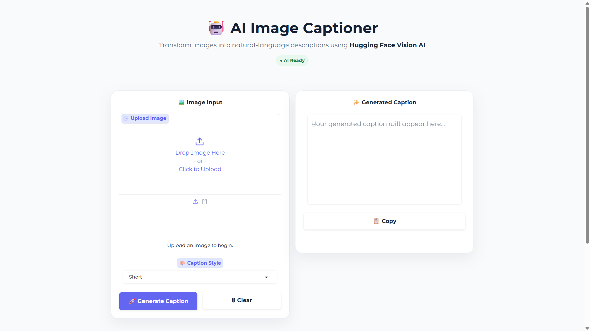
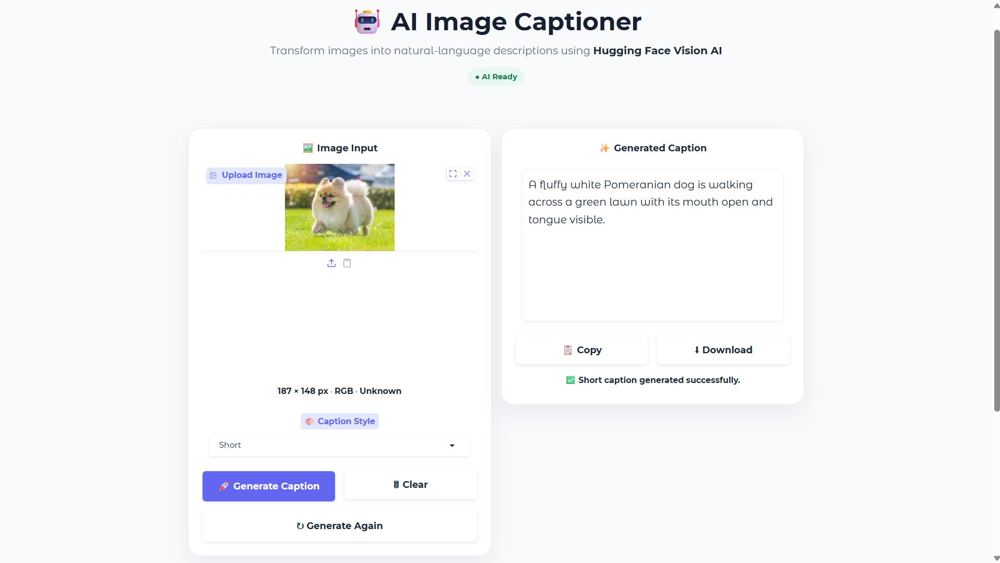
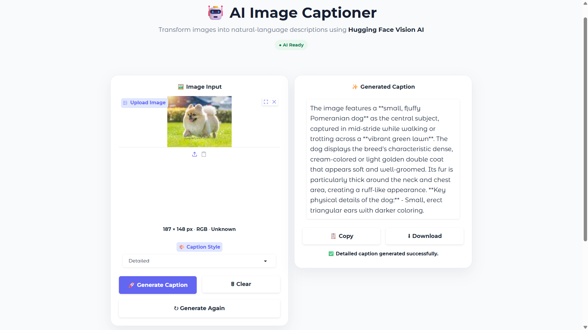
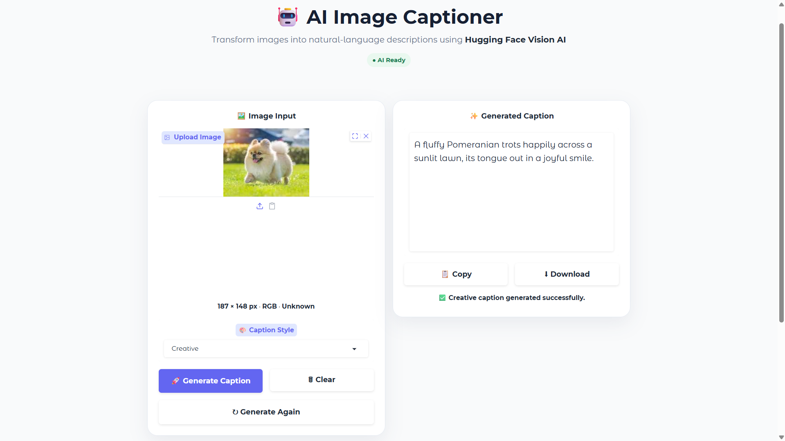

# 🤖 AI Image Captioner

An AI-powered image captioning web application that analyzes uploaded images and generates natural-language descriptions using Hugging Face Vision AI.

🌐 **Live Demo:** https://ai-image-captioner-3p7k.onrender.com

---

## ✨ Features

- 🖼️ Upload images directly from the browser
- 🤖 AI-powered image understanding
- ✍️ Multiple caption styles:
  - Short
  - Detailed
  - Creative
- 🔄 Generate captions again
- 📋 Copy generated captions
- 📥 Download generated captions
- 🧹 Clear uploaded images and results
- 📱 Responsive web interface
- 🔐 Environment-based API authentication
- ☁️ Deployed on Render
- 🚀 Uses Hugging Face Inference API

---

## 📸 Screenshots

### Main Interface



### Short Caption



### Detailed Caption



### Creative Caption



---

## 🧠 AI Model

The application currently uses:

**Model:** `zai-org/GLM-4.5V`

**Provider:** `novita`

The model receives the uploaded image together with a style-specific instruction and generates a natural-language description.

---

## ⚙️ How It Works

```text
User uploads an image
        ↓
Image validation
        ↓
Caption style selected
        ↓
Style-specific prompt created
        ↓
Image + prompt sent to Hugging Face
        ↓
Vision AI analyzes the image
        ↓
Generated caption returned
        ↓
Caption displayed in the UI


## 📁 Project Structure

AI-Image-Captioner/
├── core/              # Core application logic
├── docs/images/       # README screenshots
├── services/          # AI/API services
├── styles/            # Styling files
├── tests/             # Test files
├── ui/                # User interface components
├── app.py             # Main application
├── config.py          # Configuration
├── logger.py          # Logging
├── requirements.txt   # Python dependencies
└── .env.example       # Environment variable template
