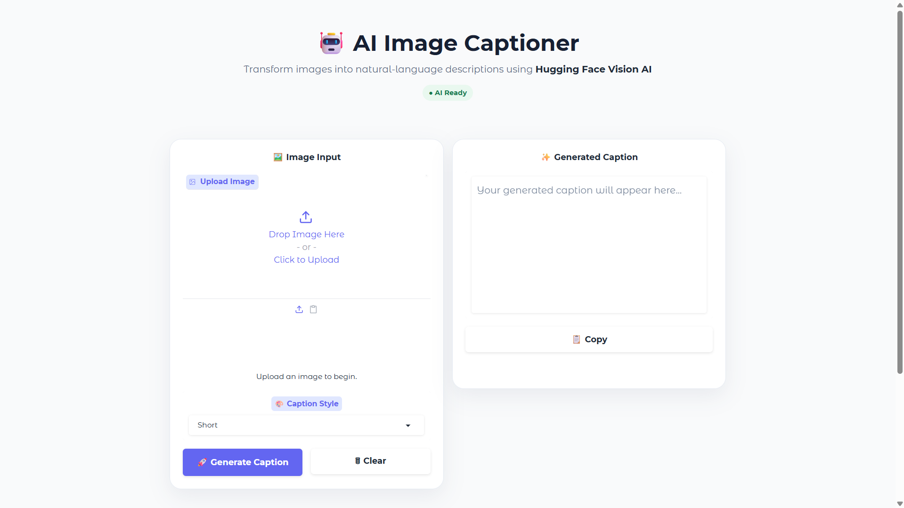
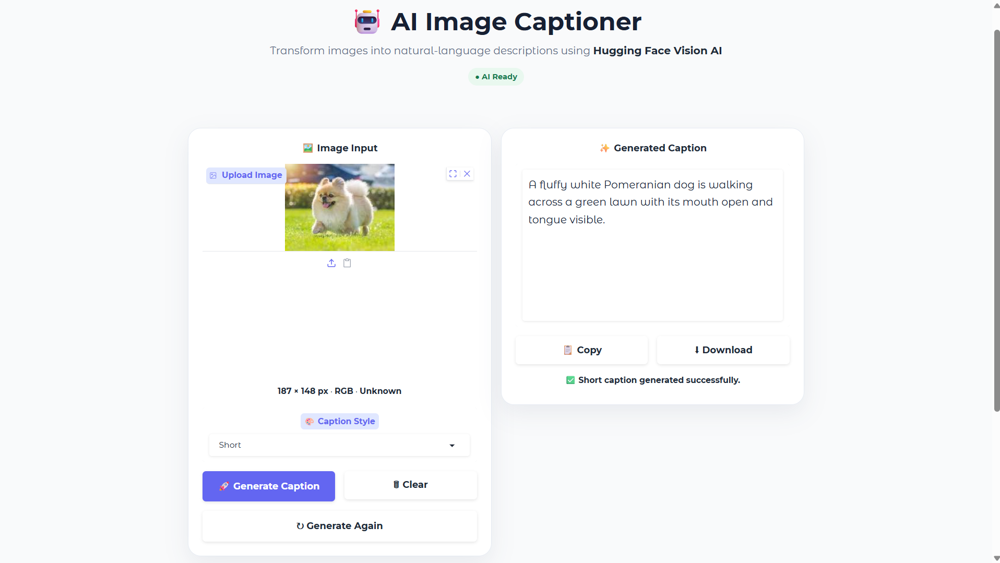
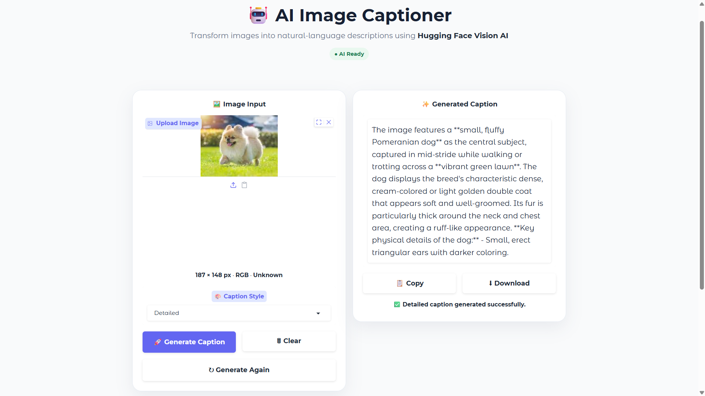
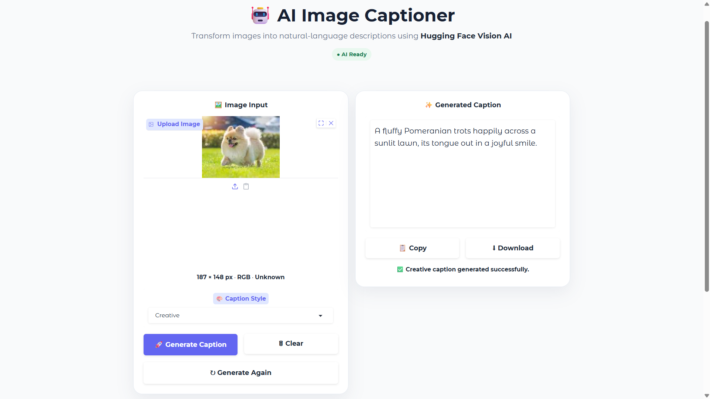

# 🤖 AI Image Captioner

An AI-powered image captioning web application that analyzes uploaded
images and generates natural-language descriptions using Hugging Face
Vision AI.

🌐 **Live Demo:** <https://ai-image-captioner-3p7k.onrender.com>

------------------------------------------------------------------------

## ✨ Features

-   🖼️ Upload images directly from the browser
-   🤖 AI-powered image understanding
-   ✍️ Multiple caption styles:
    -   Short
    -   Detailed
    -   Creative
-   🔄 Generate captions again
-   📋 Copy generated captions
-   📥 Download generated captions
-   🧹 Clear uploaded images and results
-   📱 Responsive web interface
-   🔐 Environment-based API authentication
-   ☁️ Deployed on Render
-   🚀 Uses Hugging Face Inference API

------------------------------------------------------------------------

## 📸 Screenshots

### Main Interface



### Short Caption



### Detailed Caption



### Creative Caption



------------------------------------------------------------------------

## 🧠 AI Model

The application currently uses:

**Model:** `zai-org/GLM-4.5V`

**Provider:** `novita`

The model receives the uploaded image together with a style-specific
instruction and generates a natural-language description.

------------------------------------------------------------------------

## ⚙️ How It Works

``` text
User uploads an image
        ↓
Image validation
        ↓
Caption style selected
        ↓
Style-specific prompt created
        ↓
Image + prompt sent to Hugging Face
        ↓
Vision AI analyzes the image
        ↓
Generated caption returned
        ↓
Caption displayed in the UI
```

------------------------------------------------------------------------

## 📁 Project Structure

``` text
AI-Image-Captioner/
├── core/              # Core application logic
├── docs/images/       # README screenshots
├── services/          # AI/API services
├── styles/            # Styling files
├── tests/             # Test files
├── ui/                # User interface components
├── app.py             # Main application
├── config.py          # Configuration
├── logger.py          # Logging
├── requirements.txt   # Python dependencies
└── .env.example       # Environment variable template
```

------------------------------------------------------------------------

## 🛠️ Local Setup

### 1. Clone the repository

``` bash
git clone https://github.com/Prashant7525/AI-Image-Captioner.git
cd AI-Image-Captioner
```

### 2. Create a virtual environment

``` bash
python -m venv venv
```

Activate it on Windows:

``` powershell
venv\Scripts\activate
```

### 3. Install dependencies

``` bash
pip install -r requirements.txt
```

### 4. Configure environment variables

Create a `.env` file based on `.env.example` and add your Hugging Face
API credentials.

``` env
HF_TOKEN=your_huggingface_token
```

### 5. Run the application

``` bash
python app.py
```

Then open the local URL shown by the application in your browser.

> ⚠️ Never commit your `.env` file or expose your API token publicly.

------------------------------------------------------------------------

## 🔐 Environment Variables

The application uses environment variables for sensitive configuration.

Create a `.env` file locally and configure the required Hugging Face
token:

``` env
HF_TOKEN=your_huggingface_token
```

Keep `.env` private and make sure it is excluded from version control.

------------------------------------------------------------------------

## 🧪 Testing

Tests are located in the `tests/` directory.

Run the test suite with:

``` bash
pytest
```

------------------------------------------------------------------------

## ☁️ Deployment

The application is deployed on **Render**.

Before deploying, make sure the required environment variables are
configured in the Render service settings.

------------------------------------------------------------------------

## 🛡️ Security

-   API credentials are loaded through environment variables.
-   Secrets should never be hard-coded into source files.
-   The `.env` file should never be committed to Git.
-   Use `.env.example` as a template for required environment variables.

------------------------------------------------------------------------

## 📄 License

This project is licensed under the **MIT License**. See the
[LICENSE](LICENSE) file for details.

------------------------------------------------------------------------

## 👨‍💻 Author

**Prashant7525**

GitHub: [Prashant7525](https://github.com/Prashant7525)

------------------------------------------------------------------------

⭐ If you find this project useful, consider giving it a star!

------------------------------------------------------------------------

## 🤝 Contributing

Contributions and improvements are welcome.

If you have an idea for improving the image captioning experience, documentation, accessibility, testing, or AI integration, feel free to open an issue or submit a pull request.